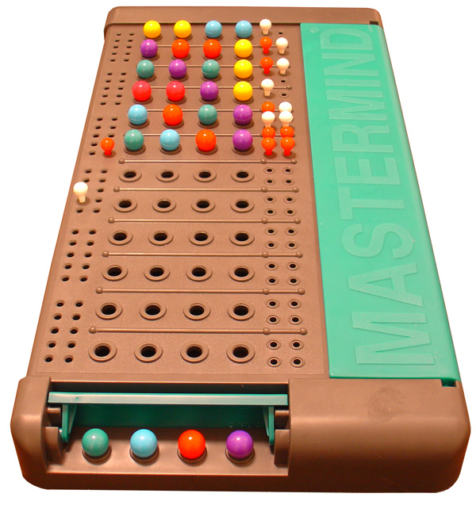

# Mastermind

Building Mastermind was an exercise in Object Oriented Programming.

This was my second attempt at using OOP. These games were still small enough that I could get away with using large and cumbersome classes. My OOP improves much more throughout the process of building Chess. I left my reflections after completing below that show my OOP skepticism.

### Background

  <figure>
    <figcaption>Original Game</figcaption>
    
  </figure>

Mastermind is a game where the computer sets 4 different colors in a specific order as a code. You have to try to guess which colors are used, and you must also get the colors in the correct order that the computer initially set them up in. If you get a white clue, it means you have the correct color, but it's in the wrong position. If you get a red clue, that means you have one correct color in the correct position.

### Video Demo

### Reflections After Completion

Mastermind was a long-winded success!

I would say that mastermind is my first true attempt at OOP. Tic-Tac-Toe was a procedural mess. I still don't know if I'm doing OOP perfectly, but I'm proud of this start that I got.

Some things I have questions about are:

1. Did I make my game class do too much? I feel like I tried to give it the single purpose/responsibility of running the game behind the scenes. I used to have the clue counter in there, but I thought that would make more sense in the Display class because it actually displays the clues to the player.

2. Are my methods far too long? I know methods are supposed to also have a single responsibility. If they're long, it's possible to break them into smaller methods, and then combine those smaller methods into a method that brings them all together. This is beneficial because it makes each method far more reusable. I tried to break down each method into small parts, but I'm not sure how much smaller I could go to maximize reusablity.

3. Are my public and private interfaces configured properly? All of my classes besides Game have public interfaces. This is because each of them are very short, and every method that they contain needs to be visible to the Game class. Maybe that points to a bigger issue? In the Game class, the only method that is public is the play method. Everything else can happen behind the scenes to make the play method work. However, are there any other methods that might be useful in the public interface?

I will have to go read some code of people who have submitted this project so that I can compare and contrast our solutions.

While I have these questions, I am still very happy with how far I've come since the Tic-Tac-Toe project. I read Practical Object Oriented Design in Ruby by Sandi Metz and got some help from some other Odin Project people that made this progress possible!